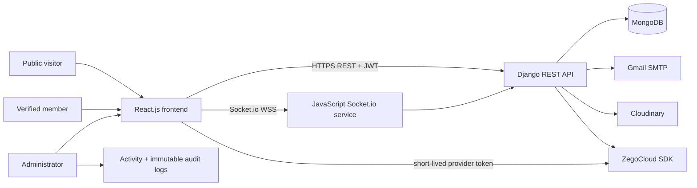
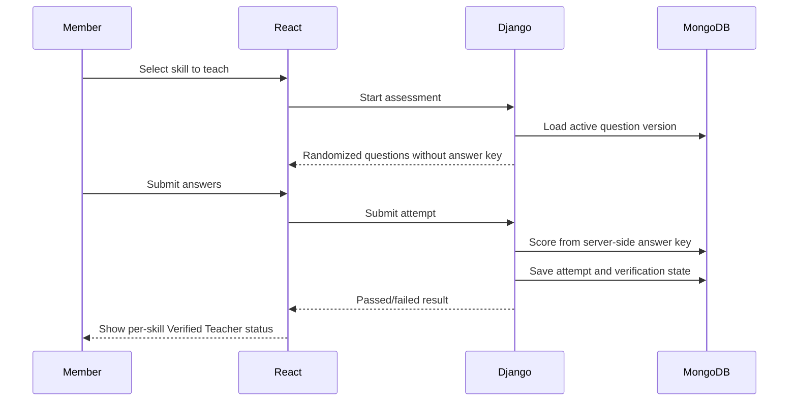
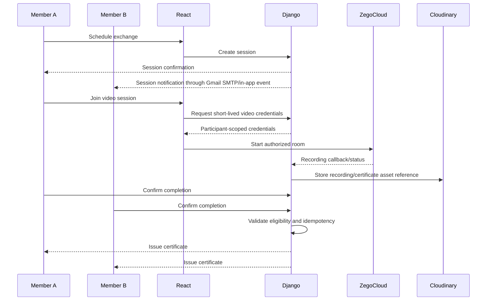
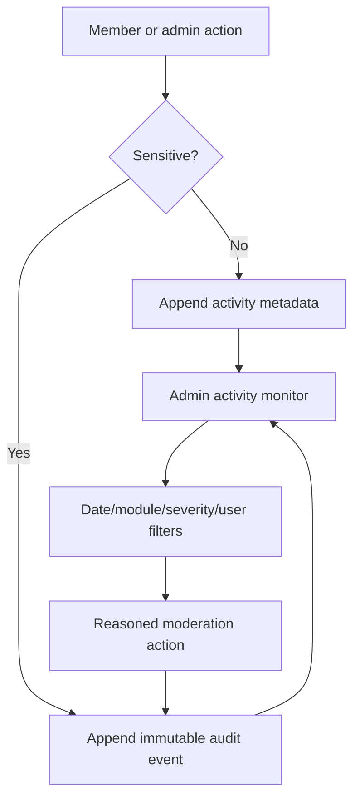

# Skill-Swap architecture diagrams

## System context

```mermaid
flowchart LR
  Visitor[Public visitor] --> React[React.js frontend]
  Member[Verified member] --> React
  Admin[Administrator] --> React
  React -->|HTTPS REST + JWT| Django[Django REST API]
  React -->|Socket.io WSS| Socket[JavaScript Socket.io service]
  React -->|short-lived provider token| Zego[ZegoCloud SDK]
  Django --> Mongo[(MongoDB)]
  Django --> SMTP[Gmail SMTP]
  Django --> Cloudinary[Cloudinary]
  Django --> Zego
  Socket --> Django
  Admin --> Audit[Activity + immutable audit logs]
```

## Skill verification flow

```mermaid
sequenceDiagram
  participant M as Member
  participant R as React
  participant D as Django
  participant DB as MongoDB
  M->>R: Select skill to teach
  R->>D: Start assessment
  D->>DB: Load active question version
  D-->>R: Randomized questions without answer key
  M->>R: Submit answers
  R->>D: Submit attempt
  D->>DB: Score from server-side answer key
  D->>DB: Save attempt and verification state
  D-->>R: Passed/failed result
  R-->>M: Show per-skill Verified Teacher status
```

## Session and certificate flow

```mermaid
sequenceDiagram
  participant A as Member A
  participant B as Member B
  participant R as React
  participant D as Django
  participant Z as ZegoCloud
  participant C as Cloudinary
  A->>R: Schedule exchange
  R->>D: Create session
  D-->>A: Session confirmation
  D-->>B: Session notification through Gmail SMTP/in-app event
  A->>R: Join video session
  R->>D: Request short-lived video credentials
  D-->>R: Participant-scoped credentials
  R->>Z: Start authorized room
  Z-->>D: Recording callback/status
  D->>C: Store recording/certificate asset reference
  A->>D: Confirm completion
  B->>D: Confirm completion
  D->>D: Validate eligibility and idempotency
  D-->>A: Issue certificate
  D-->>B: Issue certificate
```

## Admin activity model

```mermaid
flowchart TD
  Event[Member or admin action] --> Rule{Sensitive?}
  Rule -->|No| Activity[Append activity metadata]
  Rule -->|Yes| Audit[Append immutable audit event]
  Audit --> AdminView[Admin activity monitor]
  Activity --> AdminView
  AdminView --> Filter[Date/module/severity/user filters]
  Filter --> Action[Reasoned moderation action]
  Action --> Audit
```
